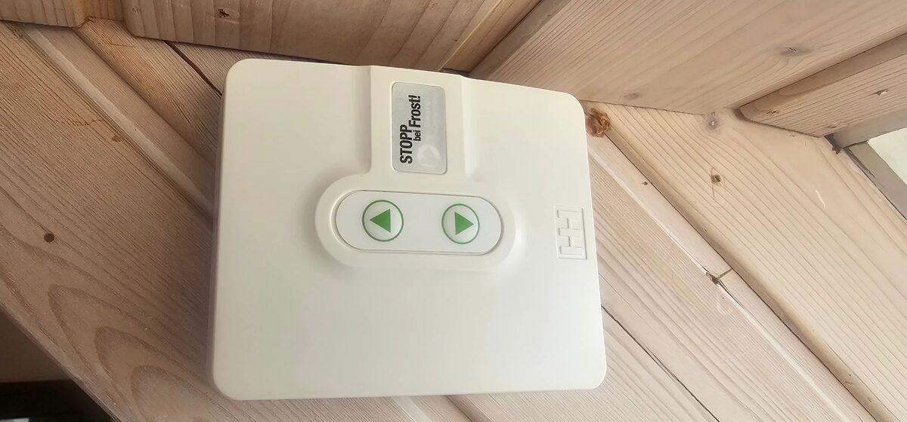
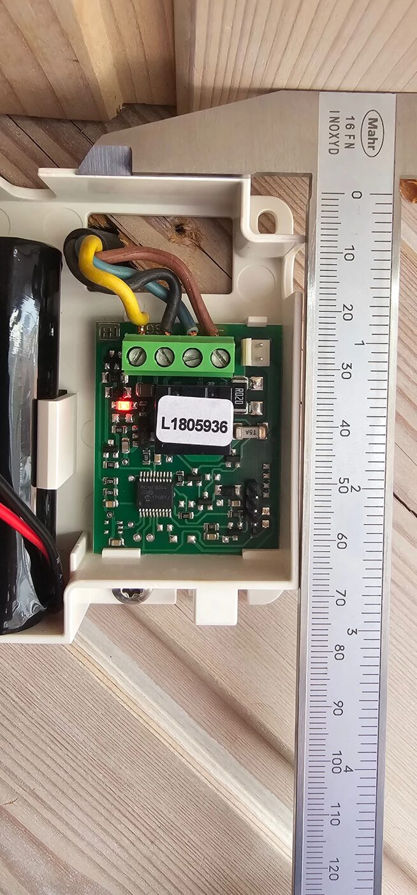
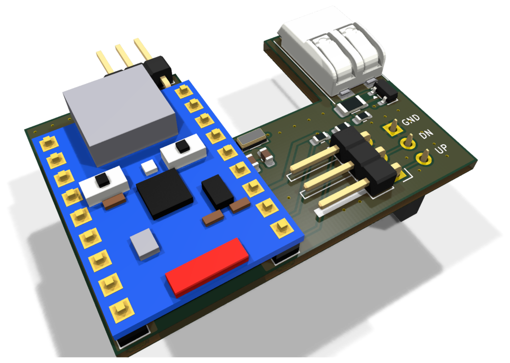

# Zigbee retrofit for a Heim & Haus solar roller shutter (ESP32-H2, Home Assistant ZHA)

Firmware and two PCB designs that add Zigbee to a battery/solar powered roller shutter drive
from **Heim & Haus**. The board plugs onto the 3-pin header of the membrane keypad and "presses"
the UP / DOWN keys electrically. The original controller stays untouched and keeps handling the
motor, its end switches and the solar charging. In Home Assistant the shutter shows up via
**ZHA** as a `cover` entity with open, close, stop and a position slider.

## Features

- Zigbee HA **Window Covering Device** (0x0202): up, down, stop, go to position (%)
- **Time-based position**, calculated from the measured travel times, reported while moving and
  stored in flash
- **Manual operation is tracked**: when someone presses a key on the drive, the firmware reads
  the key line and keeps the position in sync
- **Motor current and motor voltage sensing**: the battery voltage sag shows whether the motor
  really runs, the motor terminal voltage shows whether the controller switched it on. This
  detects the end positions and key presses that the controller took as "stop"
- **Battery and solar panel in Home Assistant**: battery voltage and charge level (battery sensor)
  and the solar panel voltage, measured every 15 minutes at rest
- **Low power**: Zigbee *sleepy end device* with light sleep between polls (peripherals powered
  down, 32 kHz crystal)
- **Zigbee OTA updates** through ZHA, with automatic rollback
- Factory reset: hold **BOOT for 5 s**

## The drive this was developed for

A **Heim & Haus solar roller shutter drive**: the motor, a controller box with a membrane keypad,
a battery pack and a solar panel. Everything below was measured on one of these drives. Other
drives with a similar keypad controller may work, but the travel times, the stop behaviour and the
voltage thresholds have to be checked.

| Controller box with its two keys | Opened: controller board, battery pack on the left |
|---|---|
|  |  |

In the opened box: the 4-pole terminal block at the top (solar panel yellow/black, motor
blue/brown), the white battery plug top right, the relay and the `R020` shunt in the middle, the
PIC below it and the **3-pin keypad header bottom right**, which is where the carrier board plugs on.

| Part | Details |
|---|---|
| Controller | Microchip PIC16F18344 at 3.3 V (HT7533 regulator, about 100 mA, not used for the retrofit) |
| Motor switching | polarity reversal by relay, 20 mOhm shunt (`R020`) in battery−, fuse T5A |
| Terminals | **SG** solar panel (+ yellow, − black), **M** motor (+ blue, − brown), battery via plug (red = +) |
| Keypad | membrane keypad on a 3-pin header (GND · DOWN · UP), keys active low, see below |
| Battery | Cellonic CC-PA000942, 3S Li-ion, 11.1 V nominal, 2600 mAh (28.9 Wh), about 9–12.6 V |
| End positions | detected by the motor itself (it switches off internally) |

Measured behaviour of the controller:

| What | Value |
|---|---|
| Key press needed | 300 ms is enough for UP and DOWN |
| Travel time down / up | 14.2 s / 16.0 s (interrupted runs add up correctly) |
| Stop | press the **opposite** key while moving |
| Run-on after the end position | motor stays powered for about 30 s; a key press in that time is a stop |
| Battery voltage sag while running | 70–92 mV down, 140–200 mV up (battery at about 12.2 V) |
| Motor terminals at rest | both without voltage |
| Sleep of the controller | not observed: a key press after more than 5 min idle works immediately |

The controller sits in a small housing; the lid leaves about 22 mm above the original board, but
only about 6 mm above our carrier board at its left edge, which limits the height of the
H2-Zero (see the [carrier README](hardware/carrier/README.md)).

## How it works

The keypad keys of the original controller (a PIC16F18344 at 3.3 V) are active low with pull-ups
on the controller board. The ESP32-H2 drives the key lines open drain through 1 kOhm, so a
"key press" is just pulling the line low for 300 ms, exactly like the real keypad.

The controller stops a moving motor when the *opposite* key is pressed. After an end position it
keeps the motor powered for about 30 s (run-on); a press during that time acts as stop, not as
start. To handle this reliably the firmware measures:

| Signal | Divider | Used for |
|---|---|---|
| Battery+ | IO4 | motor current (voltage sag 70–200 mV while running), battery level |
| Motor terminal M+ / M− | IO5 / IO1 | controller switched the motor on (one terminal at battery voltage) |
| Solar panel | IO2 | reported to Home Assistant |

All dividers are 1 MOhm / 220 kOhm with 100 nF, about 10 µA from the battery.

## Hardware

The [carrier board](hardware/carrier/README.md) (2 layers, 41.5 × 29.1 mm) plugs onto the keypad
header of the original board; the keypad itself plugs into a 90° header on the carrier, and the red
battery wire is cut and looped through a WAGO 2060 spring terminal. A **Waveshare ESP32-H2-Zero**
is soldered onto it on spacers (USB-C, BOOT and RESET are on the H2-Zero). Everything else
(regulator, protection, dividers, 32 kHz crystal) can be assembled by JLCPCB.



*Render of the carrier board with the H2-Zero (simplified model) soldered on its pin headers.*

GPIO assignment (the firmware defaults):

| Function | GPIO |
|---|---|
| UP key / DOWN key | IO10 / IO11 |
| BOOT (factory reset) | IO9 |
| Dividers battery / M+ / M− / solar | IO4 / IO5 / IO1 / IO2 |
| 32 kHz crystal | IO13 / IO14 |

### Keypad header of the original board

| Pin (from the top) | Function | Level at rest |
|---|---|---|
| top | GND | 0 V |
| middle | DOWN | 3.3 V (pull-up on the controller board) |
| bottom | UP | 3.3 V (pull-up on the controller board) |

**Ground only comes via the keypad header.** Never connect battery− to our GND: the controller
has a 20 mOhm shunt between battery− and its ground, a second connection would bypass it.

## Building and flashing the firmware

Requires [ESP-IDF v6.1](https://docs.espressif.com/projects/esp-idf/en/v6.1/esp32h2/get-started/index.html).
The Zigbee library (esp-zigbee-lib 2.0.4) is fetched from the Espressif Component Registry on the
first build. Note that Espressif officially recommends ESP-IDF v5.5 for the Zigbee SDK.

```bash
idf.py set-target esp32h2
idf.py menuconfig        # "Roller shutter": travel times, GPIOs, stop method ...
idf.py build
idf.py -p /dev/ttyACM0 flash monitor
```

GitHub Actions builds the firmware on every push. `zigbee_roller_shutter_merged.bin` from the
workflow artifacts can be flashed at address `0x0`, e.g. with the
[ESP Web Flasher](https://espressif.github.io/esptool-js/).

## Configuration (menuconfig → Roller shutter)

| Option | Default | Meaning |
|--------|---------|---------|
| Output stage | open drain | direct connection to the keypad lines (low = pressed); push-pull for optocouplers |
| Drive mode | PULSE | simulate a key press; the drive runs to the end position by itself |
| GPIO UP / DOWN | 10 / 11 | bottom / middle keypad pin |
| Stop method | opposite key | as measured on the Heim & Haus drive; alternatives: same key, dedicated key, none |
| Key press duration | 300 ms | |
| Detect manual key presses | on | key presses on the drive itself are tracked |
| Travel time up / down | 16.0 s / 14.2 s | measured on the drive |
| Dividers battery / M+ / M− / solar | GPIO 4 / 5 / 1 / 2 | −1 = not fitted |
| Motor current via battery voltage | on | checks that the motor starts and detects the end position; time-based only without divider |
| Motor current step threshold | 50 mV | measured: 70–92 mV sag down, 140–200 mV up, noise ±10 mV |
| Motor voltage threshold | 6000 mV | both motor terminals are without voltage at rest |
| Battery empty / full | 9.6 V / 12.6 V | for the charge level (3S Li-ion, linear) |
| Measurement interval at rest | 900 s | battery and solar panel |
| Poll interval | 1000 ms | response time vs. current (end device), under *Roller shutter Zigbee* |

## Adding it to Home Assistant (ZHA)

1. Flash the firmware and install the board. A factory-new device searches for a network by itself.
2. In Home Assistant: *Settings → Devices & services → ZHA → Add device*.
3. The device appears as `DIY ESP32H2-Shutter` with a **cover** entity, a battery sensor and the
   solar voltage (Analog Input).
4. **Calibrate:** run the shutter fully up once. Every move into an end position resynchronises
   the calculated position.

To pair again: hold BOOT for 5 s (factory reset) or remove the device in ZHA.

## Firmware updates over Zigbee (OTA)

The first flash has to be done over USB because of the partition table (`ota_0` + `ota_1`).

**Increase the version:** `PROJECT_VER` in `CMakeLists.txt` (form `x.y.z`). It yields the OTA file
version (`1.2.3` → `0x01020300`, must increase with every update) and the version shown in ZHA.
Every build also produces `build/131B-5201-<version>-ota-file.zigbee`, which is also a CI artifact.

**Set up Home Assistant once** (`configuration.yaml`, then restart):

```yaml
zha:
  zigpy_config:
    ota:
      extra_providers:
        - type: advanced
          warning: "I understand I can *destroy* my devices by enabling OTA updates from files. Some OTA updates can be mistakenly applied to the wrong device, breaking it. I am consciously using this at my own risk."
          path: /config/zigpy_ota
```

**Install an update:** copy the `.zigbee` file to `/config/zigpy_ota`. The device asks for updates
at start-up and every 24 h; ZHA then shows an update entity. As a sleepy end device the download
takes about 10–20 minutes, then the device restarts.

**Safety net:** a new image only boots on trial. It becomes valid once it has rejoined the Zigbee
network; if it crashes before that, the next reset boots the previous version.

## Project status

- The control logic (key pulses, stop by opposite key, run-on handling, battery-sag detection)
  was developed and measured on the real drive with a bench setup.
- The ESP32-H2 boards have not been built and tested yet. Sleep current, OTA and the motor
  voltage sensing are untested on real hardware.
- Positions between the end positions are estimated from the travel times.

## Project structure

```
main/main.c                 Zigbee: device, commissioning, Window Covering commands -> shutter
main/ota.c                  Zigbee OTA client (download, rollback confirmation, periodic query)
main/ota_file_parser.c      parser for the Zigbee OTA file format (from the esp-zigbee-sdk example)
main/Kconfig.projbuild      Zigbee and OTA settings
tools/image_builder_tool.py creates the OTA file (from the esp-zigbee-sdk)
components/shutter/         roller shutter logic without Zigbee
  shutter.c                 state machine, key pulses, position tracking, NVS
  inputs.c                  BOOT button (factory reset) and detection of manual operation
  sense.c                   voltage sensing: battery, motor terminals, solar (ADC, own dividers)
  Kconfig                   roller shutter settings
hardware/carrier/           carrier board for the ESP32-H2-Zero (KiCad 10, generated by script)
hardware/lib/               project footprint and 3D model, their generator and the routing steps
hardware/fab.py             Gerber, BOM and placement files for JLCPCB
docs/                       photos of the original controller, renders of the carrier board
```

## License

[MIT](LICENSE), except for the following files taken from Espressif's
[esp-zigbee-sdk](https://github.com/espressif/esp-zigbee-sdk) examples, which are in the public
domain / CC0: `main/ota_file_parser.c`, `main/ota_file_parser.h`, `tools/image_builder_tool.py`.

The boards use footprints from the KiCad standard library (CC-BY-SA 4.0 with an exception that
allows their use in your own designs) and a footprint generated by `hardware/lib/make_footprints.py`.

This is an independent hobby project, not affiliated with Heim & Haus. Modifying the drive is at
your own risk: you are working on a battery-powered device with a motor.
