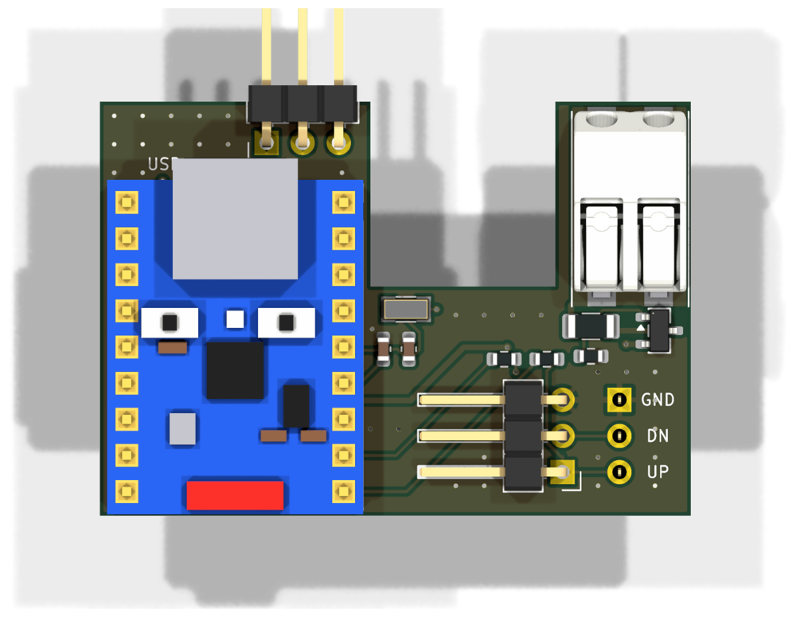
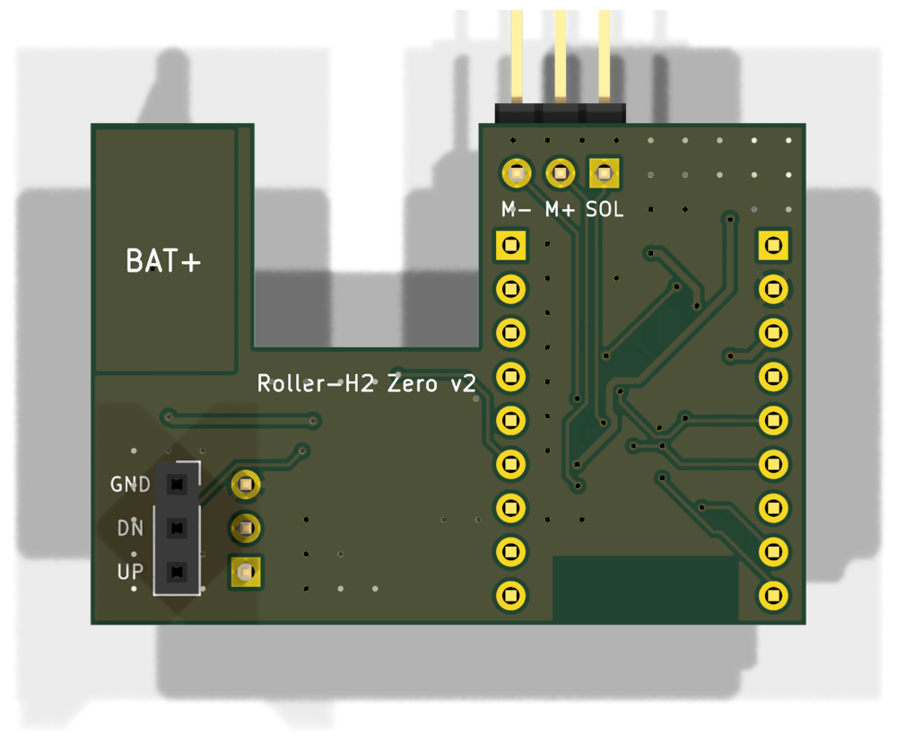

# Carrier board Roller-H2 Zero v2

2-layer board (41.5 × 29.1 mm, U-shaped) that plugs directly onto the 3-pin keypad header of the
original controller board. A **Waveshare ESP32-H2-Zero** sits on spacers above the regulator and
dividers and is soldered in by hand; JLCPCB can assemble everything else.

| Top | Bottom |
|---|---|
|  |  |

The H2-Zero in the renders is a simplified model generated by `../lib/make_footprints.py`
from the product photos. For J1 the renders use WAGO's 3D model of the 2060-452/998-404 (from
WAGO's CAD download, not included here because of its terms of use); the board itself references
a simplified model of the terminal from the same script.

## Connectors

| Ref | What | Position |
|---|---|---|
| J6 / J7 | 1×9 holes for the H2-Zero (soldered by hand), **USB-C up**, antenna down | left |
| J3 | 1×3 socket, **bottom side**, onto the original keypad header (GND · DOWN · UP) | bottom right |
| J4 | 1×3 header, 90°, membrane keypad, pins towards the board centre, GND on top | bottom right |
| J1 | WAGO 2060-452, **battery+ looped through**: cut the red battery wire and put both ends into the two spring terminals | right arm, wire entry at the top |
| J5 | 1×3 header, 90°, measurement inputs **SOL · M+ · M−** (labels on the bottom side), **optional**, see below | left arm, pins pointing up |

USB-C, BOOT and RESET are on the H2-Zero itself.

## Circuit

USB-C, ESD protection, BOOT/RESET and the EN circuit are on the H2-Zero.

- **Battery+ (VBAT_RAW)** → PTC 100 mA (F1) → **reverse polarity protection** P-MOSFET AO3407A
  (Q1, gate via 100 kΩ to GND) → VBAT → 10 Ω (R1) → VIN.
  The two WAGO poles are connected by a copper area on both layers; the motor current only flows
  through this area, not through the electronics.
- **VIN**: TVS SMF13A (D1) against spikes from the motor, 10 µF (C1) → **TPS629203** (U1) → 3.3 V
  to the **3V3 pin** of the H2-Zero. VSET open = 3.3 V, MODE 64.9 kΩ = auto PFM/PWM 1 MHz,
  EN (pin 7) to VIN, PG open. The 5V pin of the H2-Zero stays open.
- **Dividers** 1 MΩ / 220 kΩ / 100 nF each (factor 5.55, 12.6 V → 2.27 V): battery (after the
  reverse polarity protection), motor+, motor−, solar.
- **Keys**: DOWN/UP each via 1 kΩ to the H2-Zero, connected 1:1 between J3 and J4.
- **32 kHz crystal** Y1 (CL 12.5 pF) with C11/C12 (18 pF each) on IO13/IO14.
- Regulator and dividers sit **below the H2-Zero**. There is no copper on either layer below its
  ceramic antenna (bottom end, at the board edge).
- Ground only via J3 (keypad GND). **Do not connect battery−** (20 mΩ shunt on the original board).

### GPIO assignment

Matches the firmware defaults:

| Signal | GPIO | Row / pin |
|---|---|---|
| Battery (divider) | IO4 | J6 / 8 |
| Motor+ (divider) | IO5 | J6 / 9 |
| Motor− (divider) | IO1 | J6 / 5 |
| Solar (divider) | IO2 | J6 / 6 |
| UP key | IO10 | J7 / 9 |
| DOWN key | IO11 | J7 / 8 |
| 32 kHz crystal | IO13 / IO14 | J7 / 6, 5 |
| 3V3 / GND | – | J6 / 3, 2 |

## Mounting the H2-Zero and height

The H2-Zero is soldered **directly into J6/J7** with its pin headers. The plastic strip of the
header (about 2.5 mm) acts as spacer: the regulator and dividers sit below it, the tallest part
is the inductor L1 at 1.2 mm.

- Height above the board: 2.5 mm spacer + 1 mm H2-Zero board + about 3.2 mm USB-C connector ≈ 6.7 mm.
- In the housing of the Heim & Haus controller there are only about 6 mm free above the board at the left edge.
  **Check before soldering** that the lid closes; if needed, shorten the plastic strip (leave at
  least 1.5 mm above L1).
- Cut the pins flush on the bottom side: J3 plugs onto the keypad header there.

## Preparing the H2-Zero

1. **Flash it before soldering** via its USB-C. Later, flash over USB only **without battery**
   (J1 open), otherwise its LDO and the TPS629203 feed the 3V3 rail at the same time. Further
   updates via Zigbee OTA.
2. **Remove the RGB LED (IO8)**: it draws 0.5–1 mA even when off.
3. The H2-Zero's LDO (ME6217) is back-fed via 3V3 and draws around 50 µA according to its
   datasheet. **Measure the sleep current**; if it is clearly too high, remove the LDO before
   soldering (USB flashing then only works with the battery connected, OTA is unaffected).

## Generating and checking

```bash
python3 make_board.py                         # placement, nets, silkscreen
python3 route.py /path/to/freerouting.jar     # Freerouting, GND areas, DRC (up to 5 attempts)
python3 ../fab.py carrier                     # fab/gerber.zip, bom_jlc.csv, cpl_jlc.csv
```

`route.py` always starts from a fresh `make_board.py`. Freerouting (2.x, needs Java) does not give
the same result on every run and occasionally hangs; the script checks every attempt with the DRC
and routes again up to five times. A run takes 2–7 minutes.

Expected: 0 DRC errors, 0 unconnected items. The remaining "silk_edge_clearance" warnings are
intended (header pins protrude over the edge).

## Ordering at JLCPCB

1. Upload `fab/gerber.zip`, 2 layers, 1.6 mm.
2. PCB Assembly (Economic), **Assembly side: Top**, `fab/bom_jlc.csv` and `fab/cpl_jlc.csv`.
   All parts are regular JLCPCB stock, no Global Sourcing needed. JLCPCB solders the 90° headers
   J4 and J5 (C92159) by hand. J3 (8.5 mm socket, C42431866) is in the BOM/CPL but sits on the
   **bottom side**: with "Assembly side: Top", JLCPCB leaves it out (Economic assembles one side only).
3. In the placement preview, check the rotation of **U1** (SOT-583, pin 1 = FB/VSET), **Q1**,
   **J1** (wire entry up), **J4** (pins towards the board centre) and **J5** (pins up).

## Assembly by hand

1. If J3 is not fitted: solder a 1×3 socket (8.5 mm) from the **bottom side**, opening away from
   the board. Plug it onto the keypad header of the original board to align it, then solder.
2. **Measure before soldering the H2-Zero**: battery on J1 → 3.3 V at J6 pin 3, ≈ 2.2 V at
   J6 pin 8 (IO4) with a 12.2 V battery.
3. Solder the H2-Zero (flashed, RGB LED removed) with its pin headers on spacers into J6/J7,
   **USB-C towards the "USB" label**. Cut the pins flush on the bottom side.
4. Cut the red battery wire, put both ends into J1, plug the board onto the keypad header and the
   keypad into J4.
5. Optional: connect J5 to the controller's terminal block, SOL to solar + (yellow), M+ and M− to
   the motor terminals (blue, brown). Without these wires the firmware works with the battery
   voltage alone (see the main README).
